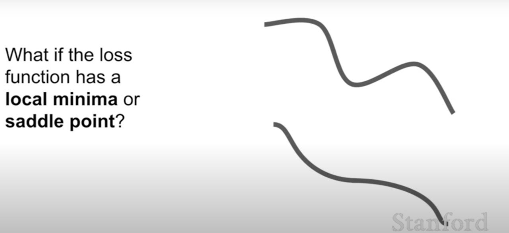
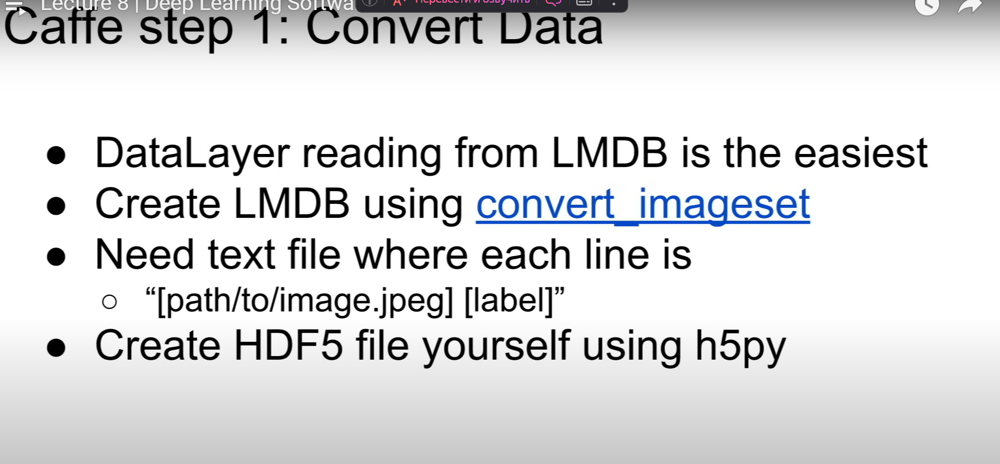
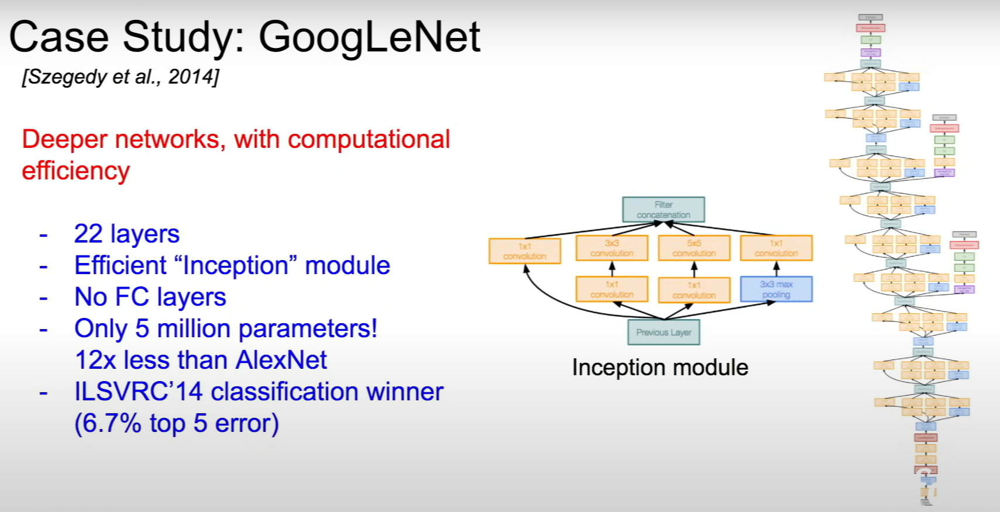
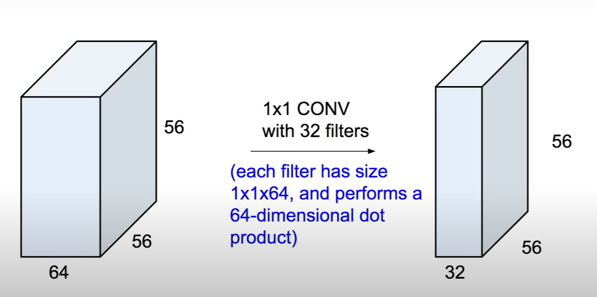
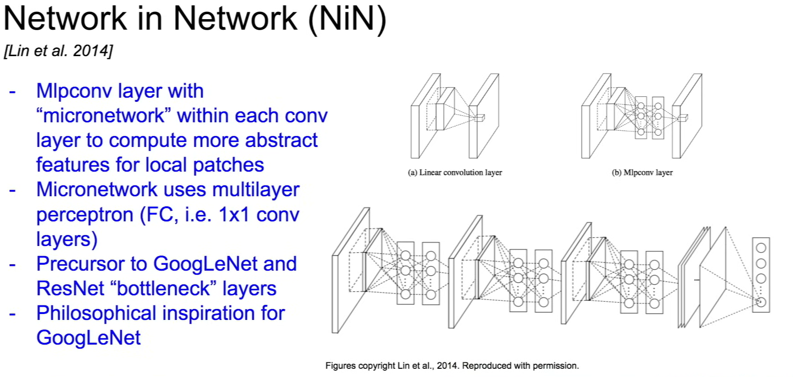

<!-- TOC -->
  * [Lecture 6 Training Neural Networks](#lecture-6-training-neural-networks)
    * [Activation funcstions](#activation-funcstions)
    * [Инициализация](#инициализация)
    * [Батч нормализация](#батч-нормализация)
  * [Lecture 7 Training Neural Networks (optimization)](#lecture-7-training-neural-networks-optimization)
    * [Опитизация](#опитизация)
    * [Image augmentation](#image-augmentation)
    * [Регулеризация](#регулеризация)
    * [Pre-rained](#pre-rained)
  * [Lecture 8 Deep Learning Software](#lecture-8-deep-learning-software)
    * [Programming on GPU](#programming-on-gpu)
      * [Frameworks reasons](#frameworks-reasons)
    * [NumPy](#numpy)
    * [TensorFlow](#tensorflow)
    * [PyTorch](#pytorch)
    * [TensorFlow](#tensorflow-1)
      * [UseCase](#usecase)
      * [Variables](#variables)
      * [Inner function](#inner-function)
      * [Optimization](#optimization)
      * [Loss](#loss)
      * [Layers](#layers)
    * [Keras](#keras)
      * [High-Level over TS](#high-level-over-ts)
      * [Tensorboard](#tensorboard)
    * [PyTorch](#pytorch-1)
      * [Abstract levels](#abstract-levels)
      * [PuTorch = Numpy + GPU](#putorch--numpy--gpu)
      * [PyTorch Autograd vars](#pytorch-autograd-vars)
      * [Create own PyTorch nodes](#create-own-pytorch-nodes)
      * [High-Level frameworks](#high-level-frameworks)
      * [Create own PyTorch model / class](#create-own-pytorch-model--class)
      * [DataLoader](#dataloader)
      * [PreTrain](#pretrain)
      * [PyTorch VS TensorFlow](#pytorch-vs-tensorflow)
        * [Static](#static)
        * [Dinamic](#dinamic)
    * [Caffe / Caffe 2](#caffe--caffe-2)
    * [Conclusion](#conclusion)
  * [Lecture 9 CNN Architectures](#lecture-9-cnn-architectures)
    * [Winners](#winners)
    * [LeNet-5](#lenet-5)
    * [AlexNet](#alexnet)
    * [VGGNet](#vggnet)
      * [Why 3x3](#why-3x3)
      * [Memory](#memory)
      * [Note](#note)
    * [GoogLeNet](#googlenet)
      * [Inception](#inception)
      * [Conclusion](#conclusion-1)
    * [ResNet](#resnet)
      * [Conclusion](#conclusion-2)
    * [All-in-all](#all-in-all)
    * [Other](#other)
      * [NiN Network in network](#nin-network-in-network)
      * [Improved ResNet](#improved-resnet)
      * [Wide ResNet](#wide-resnet)
      * [ResNeXT](#resnext)
      * [FractalNet](#fractalnet)
      * [DenseNet](#densenet)
      * [SqueezeNet](#squeezenet)
    * [Summary](#summary)
<!-- TOC -->

## Lecture 6 Training Neural Networks

  
Развернуть

[video](https://www.youtube.com/watch?v=wEoyxE0GP2M&list=PLSVEhWrZWDHQTBmWZufjxpw3s8sveJtnJ&index=6&pp=iAQB)

### Activation funcstions

Минусы сигмоида:

- mean != 0
- затухание при больших по модулю значений
- exp() ложно считать

leaky Relu

### Инициализация

все 0 - одинаковые + затухание
маленькие с mean = 0 -> затухание
Лучше равномерное / |input|

Для RELu |input / 2|

### Батч нормализация

В батч нормализации есть парамеры

В перпроцессоринге сдвиг на mean

## Lecture 7 Training Neural Networks (optimization)

  
Развернуть

[video](https://www.youtube.com/watch?v=_JB0AO7QxSA&list=PLSVEhWrZWDHQTBmWZufjxpw3s8sveJtnJ&index=7&pp=iAQB)

- Random search оч широкий

### Опитизация

Как правило, в этом алгоритме подбирают лишь один гиперпараметр
learning rate. Остальные же: B1 и B2 – оставляют стандартными и равными 0.9, 0.99 и 1e-8 соответственно.
Подбор a составляет главное искусство.

- Momentum - скорость "инерция"
- AdaGard
-

Идея следующая: если мы вышли на плато по какой-то координате и соответствующая компонента градиента начала затухать, то
нам нельзя уменьшать размер шага слишком сильно, поскольку мы рискуем на этом плато остаться, но в то же время уменьшать
надо, потому что это плато может содержать оптимум. Если же градиент долгое время довольно большой, то это может быть
знаком, что нам нужно уменьшить размер шага, чтобы не пропустить оптимум. Поэтому мы стараемся компенсировать слишком
большие или слишком маленькие координаты градиента.

Но довольно часто получается так, что размер шага уменьшается слишком быстро и для решения этой проблемы придумали
другой алгоритм.

RMSProp
Модифицируем слегка предыдущую идею: будем не просто складывать нормы градиентов, а усреднять их в скользящем режиме:

Не сразу!! Сначала просто a, а потом смотрим, нужно ли вообще decay

- Ансамбли!+2%
  

### Image augmentation

### Регулеризация

### Pre-rained

## Lecture 8 Deep Learning Software

  
Развернуть

[video](https://youtu.be/_JB0AO7QxSA?list=PLSVEhWrZWDHQTBmWZufjxpw3s8sveJtnJ)

### Programming on GPU

- cuBLAST - matrix
- **Используй cuDNN** - ускоритель для Deep Learning.

#### Frameworks reasons

### NumPy

### TensorFlow

+ GPU and backprop

### PyTorch

+ GPU and backprop

### TensorFlow

#### UseCase

- Define vars
- Define computation graph
- Say that we want to count gradients
- Start session where we create/get data and then say what we want to get (loss functions and graads) and give data for
  train
- After that we get numpy array result

Training 

#### Variables

Due to it is too slow to move data from ts to numpy we can define inner TS vars. But of cause we need to init it.
Then we can define how to use them in our graph. It will be done automatically

Now we update values

#### Inner function

#### Optimization

#### Loss

#### Layers

### Keras

#### High-Level over TS

#### Tensorboard

You can visualize computation graph

Граф можно разбивать!!

### PyTorch

#### Abstract levels

#### PuTorch = Numpy + GPU

#### PyTorch Autograd vars

#### Create own PyTorch nodes

#### High-Level frameworks

#### Create own PyTorch model / class

#### DataLoader

#### PreTrain

#### PyTorch VS TensorFlow

- PyTorch - create graph every time -> code is cleaner
- TF - define once and use many times.

##### Static

##### Dinamic

Пересчёт размеров!

### Caffe / Caffe 2

### Conclusion

## Lecture 9 CNN Architectures

  
Развернуть

[video](https://youtu.be/DAOcjicFr1Y?list=PLSVEhWrZWDHQTBmWZufjxpw3s8sveJtnJ)

### Winners

### LeNet-5

### AlexNet

### VGGNet

#### Why 3x3

#### Memory

#### Note

**FC7** is rather good for relearning for other data 

### GoogLeNet

#### Inception

Count Operation problem

Solution 1x1

Can train each part

#### Conclusion

### ResNet

Mush more layers using residual connection 

То есть теперь мы учим остаток для *x*

#### Conclusion

- "Пронос" остатка
- /2: *2 #фильтров и /2 size by stride

### All-in-all

### Other

#### NiN Network in network

#### Improved ResNet

#### Wide ResNet

wide -> parallel

#### ResNeXT

#### FractalNet

#### DenseNet

#### SqueezeNet

### Summary

